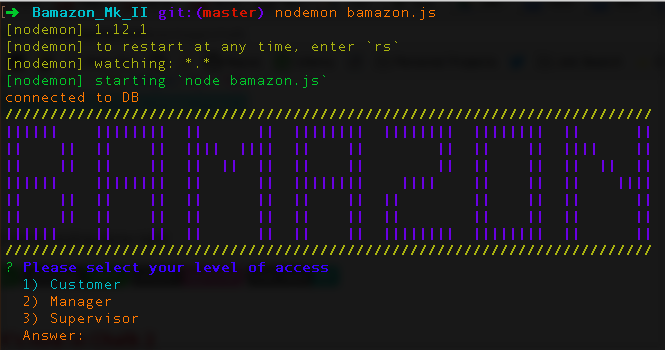
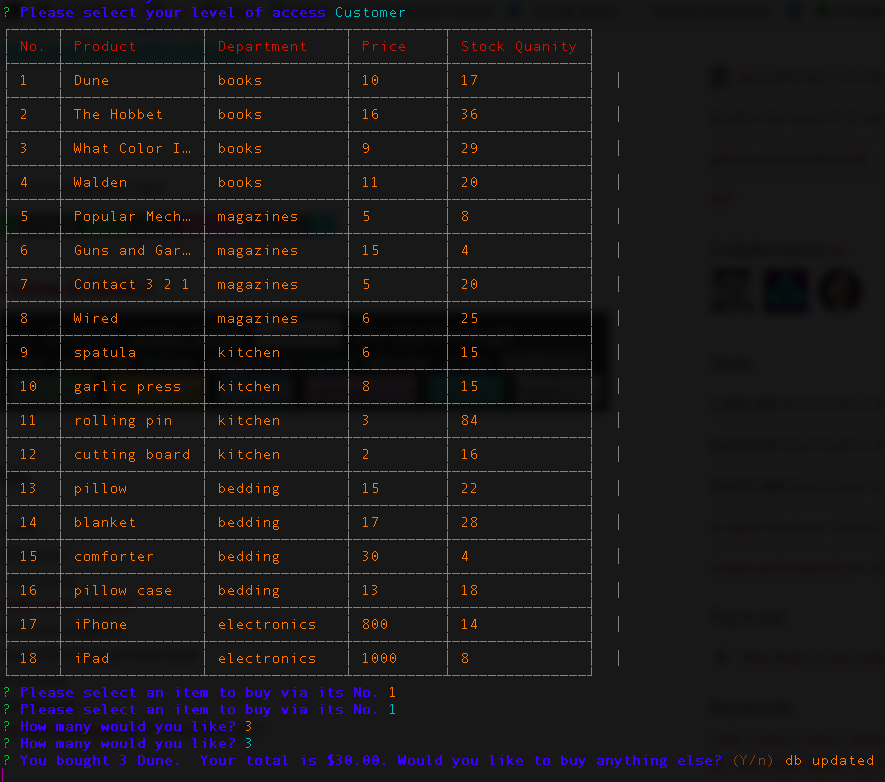
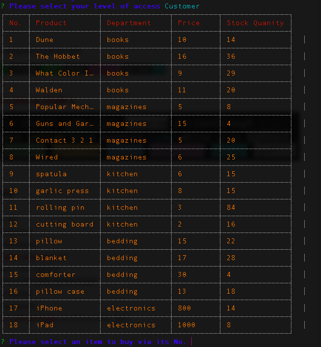
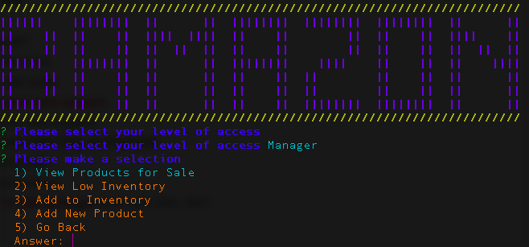

# Bamazon_Mk_II
###### An upgraded version of Bamazon (a "Amazon-like" store front) that utilizes Node.js, MySQL, and a local database
---

## Bamazon MK II Setup

##### Step 1

* Install the npm modules needed by navigating to the Bamazon Mk II directory within the terminal and type `npm i` (see below)

**NPM Modules Used**
* chalk
* cli-table-redemption
* inquirer
* mysql

##### Step 2

* Run the bamazon.js file using the command `node bamazon.js`
* *NOTE:* I have **nodemon** installed so please feel free to use it if you do as well

## Bamazon MK II Usage

* You will have three options to choose from:
  * Customer
  * Manager
  * Supervisor (still under construction)

##### Choosing **Customer**

* Choosing **Customer** will bring up the following table:

* You can then select the item you wish to "purchase" and the quantity.  You will be given a total and the option to "purchase" another item.

* The database is updated with its new totals.  See item No. 1.

* Selecting **No** will bring you back to welcome.

##### Choosing **Manager**

* Choosing **Manager** will bring up the following options:
  * View Products for Sale
  * View Low Inventory
  * Add To Inventory
  * Add New Product
  * Go Back

* **View Products for Sale** will bring up the table of items like the one the customer sees.

* **View Low Inventory** will bring up a table of items that have a quantity less than five.

* **Add To Inventory** allows you to increase the quantity of an item in the inventory.

**Add New Product** allows you to put a brand new item into the inventory.

##### Choosing **Supervisor**

* **COMING SOON**
